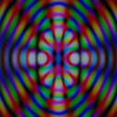
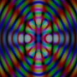

# Homemade JPEG-like compression

Fun weekend project

Before: 
After: 

## Human test

Before: 
After: 

(12% of original file size when compressed in my file format, 6% of original size when further gzipped)

Credits: https://unsplash.com/photos/JxfYO0hhZGQ

## Credits

Used DCT function from https://www.geeksforgeeks.org/discrete-cosine-transform-algorithm-program/

Thanks to the following documentation for inspiring:

 * https://www.image-engineering.de/library/technotes/745-how-does-the-jpeg-compression-work
 * https://www.youtube.com/watch?v=Kv1Hiv3ox8I